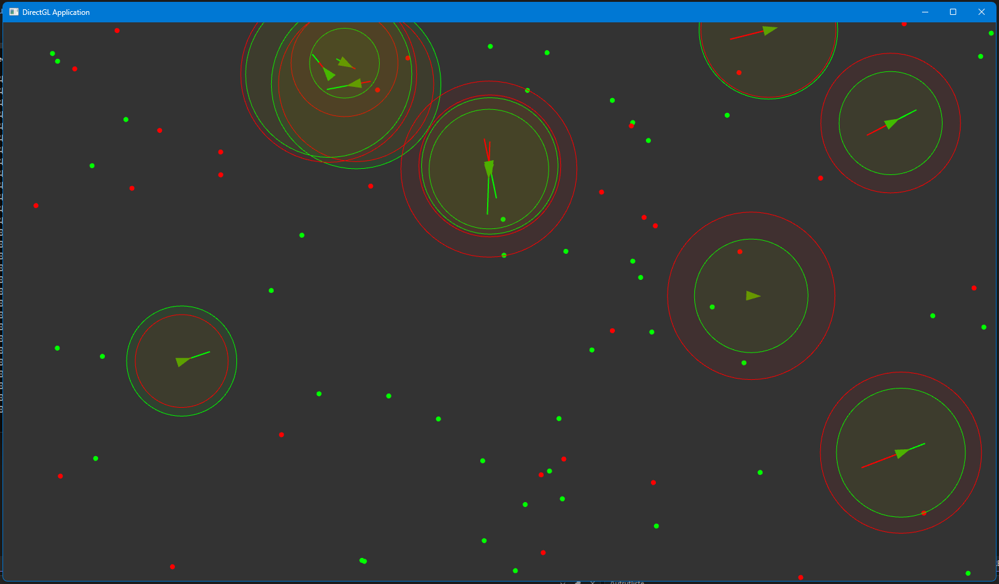

# DirectGL (DirectX in OpenGL)

This project is ment to be a learning project for graphical framework design.
I've created a little example in the "App" project. Note that nothing's stable and WILL change in future.
The code is written in C++ 23 using C++ 20-Modules & modern approaches like concepts etc.

Im not sure how far things will go since im developing this library jff.

Here's a little screenshot of the example. The original source code of the example is written by Daniel Shiffman (TheCodinTrain) in P5.js

